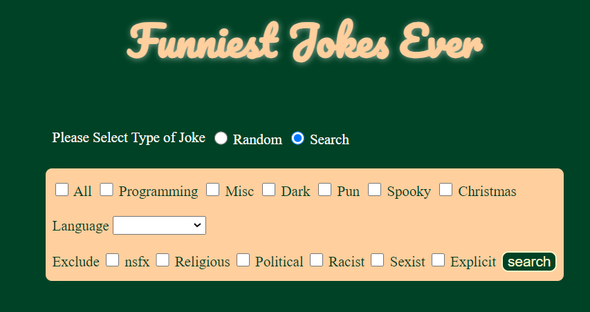
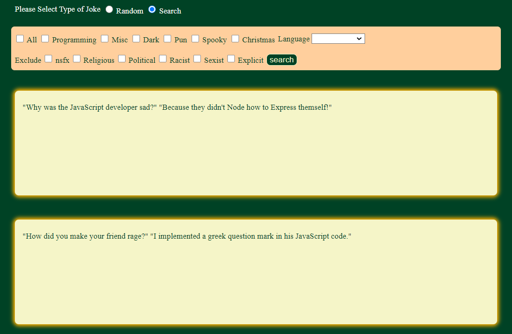

# Joke Random Generator
**Joke Random Generator**, is a [node.js](https://nodejs.org/en/docs) web application that aims to generate a random joke to the user every 10s. Furthermore, it's possible to search for a joke(s) based on the following criterias:
- Categories
   + Programming
   + Miscellanious
   + Pun
   + Christmas
   + Dark
   + Spooky
- Language
   + English
   + French
   + Spanish
   + Portuguese
   + Szech
- Black List Flags
   + Nsfw 
   + Religious
   + Political
   + Sexist
   + Racist
   + Explicit

> **Note:** Joke random Generator, limits the returned results to 10 records only.
> 
**Joke Random Generator**, uses a REST API [Joke API](https://sv443.net/jokeapi/v2/) and was built for academic purpose, however it can be further used or enhanced to suit any needs or different purposes. 
The following technologies and frameworks were used to develop this web application:
- [Node.js](https://nodejs.org/en/docs)
- [Express.js](https://expressjs.com/)
- [Npm](https://www.npmjs.com/) module [body-parser](https://www.npmjs.com/package/body-parser)
- [EJS](https://ejs.co/#docs) for templating
- [Npm](https://www.npmjs.com/) module [axios](https://www.npmjs.com/package/axios)
- [Javascript](https://developer.mozilla.org/en-US/docs/Web/JavaScript)
- [Jquery](https://api.jquery.com/)
- [Html](https://html.com/)
- [Css](https://www.w3.org/Style/CSS/Overview.en.html#:~:text=Cascading%20Style%20Sheets%20(CSS)%20is,from%20the%20CSS%20working%20group.)

## Installation

First of all you need to make sure that you have node.js running in your server or local machine (assuming that you have downloaded and installed it). Open **terminal** on Linux or **cmd** on windows and run the following command:

> node

If you do have node running on your machine it should reply a message like shown below, but probabilly the version of your node will be different from mine:

> Welcome to Node.js v18.17.0.

Upon accomplishment of the aforementioned steps, you will all set regarding node installation and you can now install all nodes dependecies, by running the following command:

> npm i

Now, you can run the application:

> node index.js

If everything goes well, you should have the following message in your command line:

> Server is running on port 3000
>

## Usage

Open your browser and type the following text in your address bar: 
> localhost:3000

You can click **search** option and select as many criterias as you want to fetch the data from the [API](https://sv443.net/jokeapi/v2/)

<!-- -->

A demo of some of the results that are presented to the end user

<!-- -->

## Credits

[Dr. Angela Yu](https://github.com/angelabauer)
